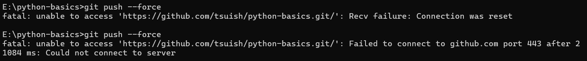

# python-basics
学习Python基础知识


## 💻 设备环境与同步配置
通过 Git 实现 机械革命 (Windows 11) 与 MacBook Air M1 (macOS) 的无缝衔接。


机械革命的本地目录：E:\python-basics

MacBook Air M1的本地目录：待补充

## 课程信息
一个是学习强国上的，南华大学的

一个是中国大学mooc上的，南开大学的

待完整补充，包括具体的课程名、链接等


## git操作
如果觉得每次输入 "origin 分支名" 太麻烦，可以执行一次：
```
# 设置
git push -u origin 分支名

# 查看
git branch -vv
```
之后你就只需要输入 git push ，Git 就会自动记住你要推送到哪里了。


如果远程仓库已经有了别人的提交，直接 push 会被 Git 拒绝（提示 fetch first 或 rejected）。


为了保证代码不丢失，且提交历史清晰，最标准的流程是 **“拉取 - 解决 - 提交”**。

**1.保存本地修改**
> 注意：必须先 commit 到本地，否则接下来的 pull 可能会因为文件冲突而中止。
```
git add .
git commit -m "你的功能描述"
```

**2.拉取远程更新 (关键步骤)**
```
# --rebase:直线提交
# -v:查看拉取情况
git pull --rebase -v
```

**3.处理可能出现的情况**

**情况 A：自动合并成功。** Git 会自动创建一个“Merge”提交，你直接进入下一步即可。

**情况 B：有冲突 (Conflict)。** Git 会提示哪些文件冲突了。你需要打开 PyCharm，在编辑器里手动选择保留谁的代码，解决后：
```
git add <冲突的文件名>
git commit -m "fix: 解决合并冲突"
```

**4.正式推送**

```
git push
```


**进阶技巧：使用 --rebase 让提交记录更整洁**

如果你不希望提交历史里满是“Merge branch...”这种无意义的自动合并信息，可以使用变基模式：
```
git pull --rebase origin main
```
它的原理是： 把你本地还没上传的 commit 先“摘下来”，把远程的新代码接在后面，最后再把你那几个 commit “补”在最顶端。这样你的提交历史看起来就像一条直线。


**查看快照**
```
git log --all --graph --oneline

# 或者
git gl
```

> git gl的前提是设置了快捷命令:
git config --global alias.gl "log --all --graph --pretty=format:'%C(yellow)%h%Creset %C(green)%ad%Creset %C(blue)[%an]%Creset %s %C(red)%d%Creset' --date=format:'%Y-%m-%d %H:%M:%S'"


**修改最近一次提交（最简单）**
如果你刚刚才完成 git commit，发现注释写错了，可以使用 --amend 参数。

修改最近一次提交（在编辑器中修改）
如果你想在弹出的文本编辑器里更详细地修改，直接输入：
```
git commit --amend
```

如果该提交已经 push 到了 GitHub，修改后需要执行 git push --force 覆盖远程记录（请确保没有人在和你共用这个分支）。


**解决git push --force网络问题失败**


如果正在使用 VPN，Git 可能没有自动走你的代理通道。可以尝试给 Git 设置临时代理（假设你的代理端口是常见的 7890，请根据 VPN 实际端口修改）：

```
# 设置 HTTP 代理
git config --global http.proxy http://127.0.0.1:7890
# 设置 HTTPS 代理
git config --global https.proxy http://127.0.0.1:7890
```
如果想取消代理，使用：
```
git config --global --unset http.proxy
```